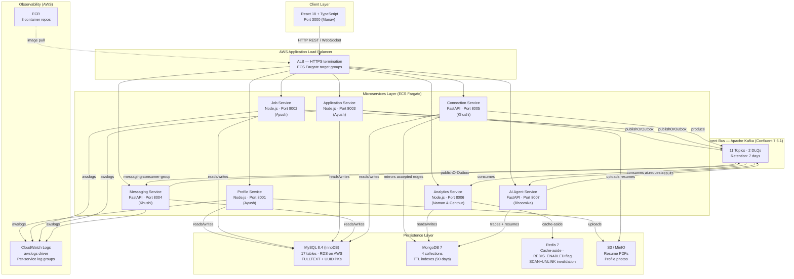
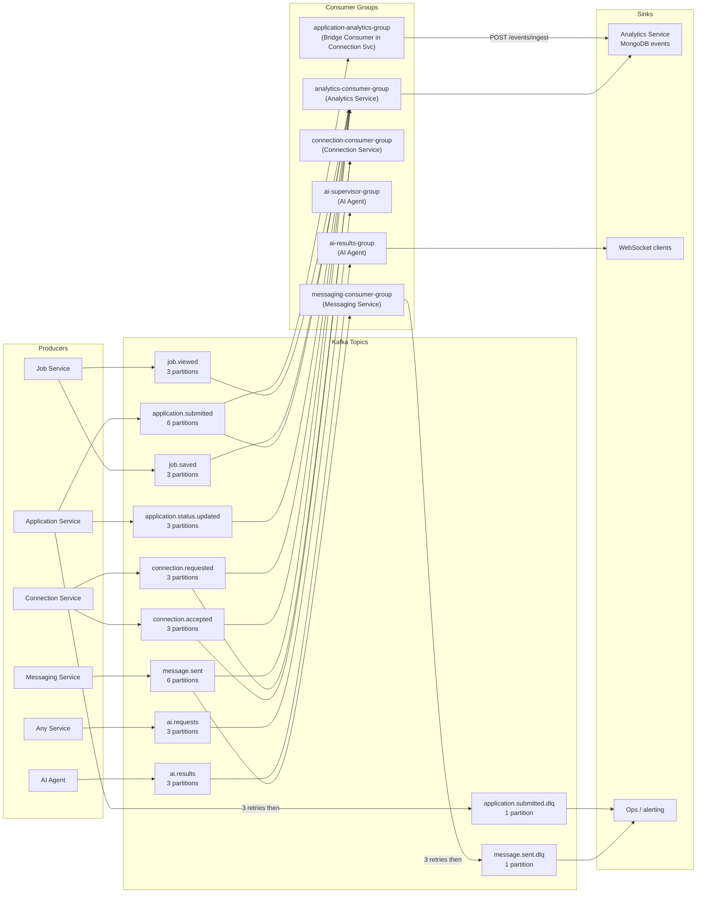
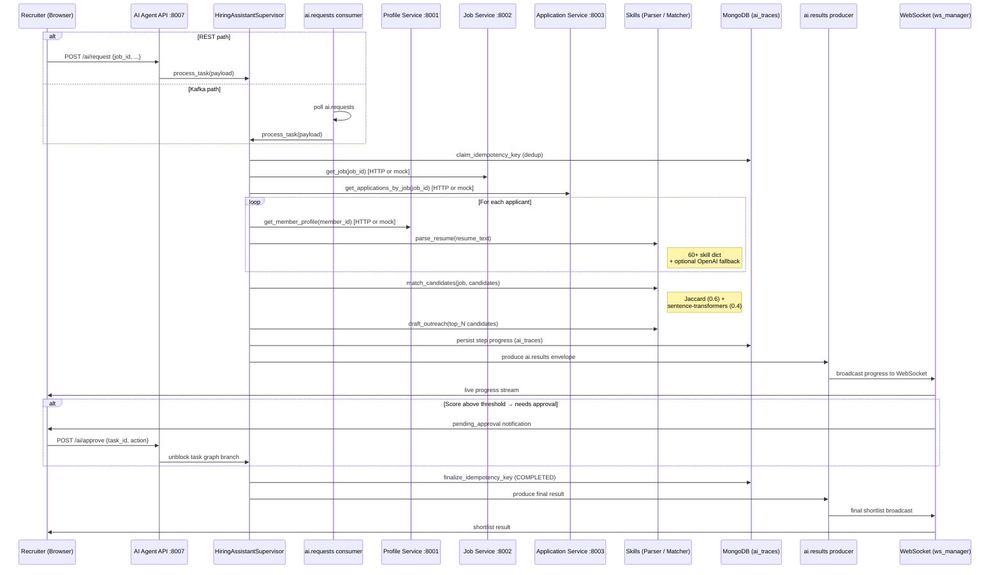
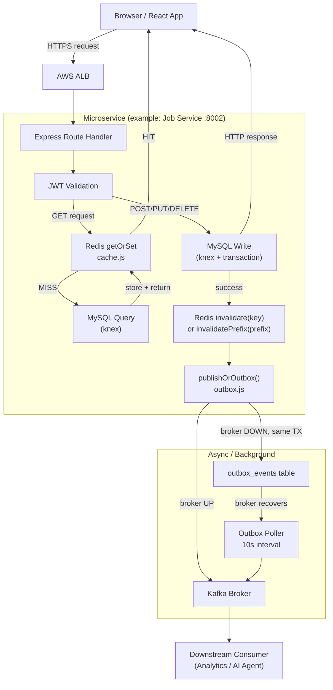
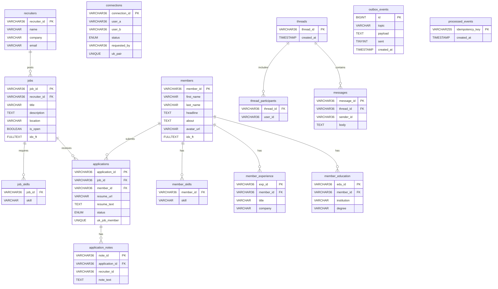

# LinkedIn Clone — Architecture Diagrams
> All diagrams generated from actual source code. Last updated May 2025.

---

## Diagram 1 — Full System Architecture

---

## Diagram 2 — Kafka Event Flow

---

## Diagram 3 — AI Agent Workflow

---

## Diagram 4 — Request Flow (Frontend → DB → Response)

---

## Diagram 5 — Database Schema Relationships

---

### MongoDB Collections (schema-free, shown as reference)

| Collection | Key Fields | TTL |
|---|---|---|
| `events` | `idempotency_key` (unique), `event_type`, `_received_at`, `_topic` | 90 days |
| `ai_traces` | `task_id`, `trace_id`, `steps[]`, `status` | none (audit) |
| `resumes` | `member_id`, `skills[]`, `embeddings[]` | until deletion |
| `profile_views` | `viewer_id`, `viewed_id`, `viewed_at` | 90 days |
