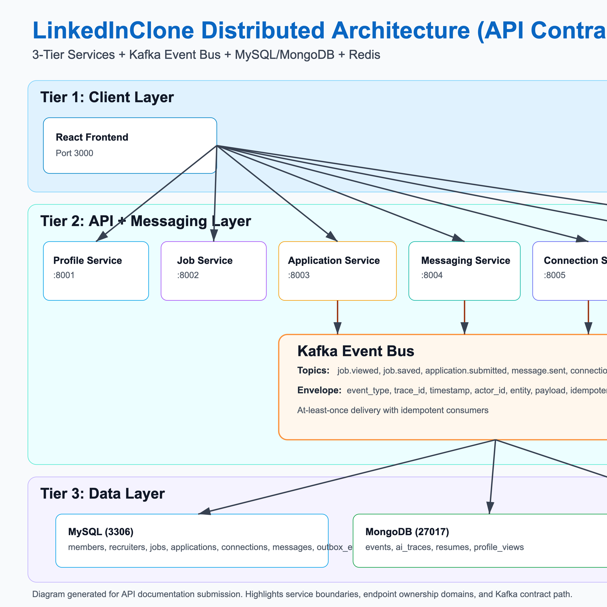

# LinkedInClone API Documentation

**Course:** Distributed Systems  
**Professor:** Simon Shim  
**Group Members:** Naman Vipul Chheda, Khushi Donda, Ayush Sunil Gawai, Bhoomika Lnu, Manav Patel, Parth Patel, Sharan Somshekhar Patil, Centhurvelan Ramalingam Sakthivel



## 1. Scope and Service Boundaries

This document defines the group API contract for all distributed services, including:
- service boundaries
- endpoint definitions
- request/response contracts
- status/error conventions
- Kafka topics and event envelope
- failure handling contract

| Service | Port | Responsibility |
|---|---:|---|
| Profile Service | 8001 | Member profile CRUD + search |
| Job Service | 8002 | Job CRUD + search + close + by recruiter |
| Application Service | 8003 | Submit/retrieve/list/update applications |
| Messaging Service | 8004 | Threads + messages |
| Connection Service | 8005 | Connection request/accept/reject/list |
| Analytics/Events Service | 8006 | Event ingest + analytics APIs |
| AI Agent Service | 8007 | AI request/status/approve + stream |

## 2. Global API Standards

- Primary protocol: JSON over HTTP
- Endpoint convention: `POST` for business operations
- Shared health endpoint: `GET /health`
- Supported status codes: `200`, `201`, `202`, `400`, `404`, `409`, `500`, `503`

**Success envelope**
```json
{
  "success": true,
  "data": {},
  "trace_id": "uuid"
}
```

**Error envelope**
```json
{
  "success": false,
  "error": {
    "code": "ERROR_CODE",
    "message": "Human-readable message",
    "details": {}
  },
  "trace_id": "uuid"
}
```

## 3. Health Contract

`GET /health` on every service:

```json
{
  "status": "ok",
  "service": "profile|job|application|messaging|connection|analytics|ai-agent",
  "db": "connected|disconnected",
  "kafka": "connected|disconnected"
}
```

## 4. Endpoint Contract by Service

### 4.1 Profile Service (`:8001`)

| Method | Endpoint | Request | Response |
|---|---|---|---|
| POST | `/members/create` | `{first_name,last_name,email,phone,location,headline,about,skills[],experience[],education[],profile_photo_url}` | `201` profile; `409 DUPLICATE_EMAIL`; `400 VALIDATION_ERROR` |
| POST | `/members/get` | `{member_id}` | `200` profile; `404 MEMBER_NOT_FOUND` |
| POST | `/members/update` | `{member_id, fields_to_update...}` | `200` updated profile; `404 MEMBER_NOT_FOUND`; `400 VALIDATION_ERROR` |
| POST | `/members/delete` | `{member_id}` | `200 {deleted:true}`; `404 MEMBER_NOT_FOUND` |
| POST | `/members/search` | `{keyword?,skill?,location?,page,page_size}` | `200 {results,total,page}` |

### 4.2 Job Service (`:8002`)

| Method | Endpoint | Request | Response |
|---|---|---|---|
| POST | `/jobs/create` | `{company_id,recruiter_id,title,description,seniority_level,employment_type,location,remote_type,skills_required[],salary_range?,status}` | `201` created; `400 VALIDATION_ERROR`; `404 RECRUITER_NOT_FOUND` |
| POST | `/jobs/get` | `{job_id}` | `200` job; `404 JOB_NOT_FOUND` |
| POST | `/jobs/update` | `{job_id,fields...}` | `200` updated; `404 JOB_NOT_FOUND` |
| POST | `/jobs/search` | `{keyword?,location?,employment_type?,industry?,remote_type?,page,page_size}` | `200 {results,total,page}` |
| POST | `/jobs/close` | `{job_id}` | `200 {status:'closed'}`; `404 JOB_NOT_FOUND`; `409 ALREADY_CLOSED` |
| POST | `/jobs/byRecruiter` | `{recruiter_id,page,page_size}` | `200 {results,total}` |

### 4.3 Application Service (`:8003`)

| Method | Endpoint | Request | Response |
|---|---|---|---|
| POST | `/applications/submit` | `{job_id,member_id,resume_url?,resume_text?,cover_letter?,answers?}` | `201 {application_id}`; `409 DUPLICATE_APPLICATION`; `409 JOB_CLOSED`; `404 JOB_NOT_FOUND/MEMBER_NOT_FOUND` |
| POST | `/applications/get` | `{application_id}` | `200` application; `404 NOT_FOUND` |
| POST | `/applications/byJob` | `{job_id,page,page_size}` | `200 {results,total}` |
| POST | `/applications/byMember` | `{member_id,page,page_size}` | `200 {results,total}` |
| POST | `/applications/updateStatus` | `{application_id,status,note?}` | `200 {updated:true}`; `400 INVALID_STATUS_TRANSITION` |
| POST | `/applications/addNote` | `{application_id,recruiter_id,note_text}` | `200 {note_id}`; `404 APPLICATION_NOT_FOUND` |

### 4.4 Messaging Service (`:8004`)

| Method | Endpoint | Request | Response |
|---|---|---|---|
| POST | `/threads/open` | `{participant_ids:[id1,id2]}` | `201 {thread_id}`; `409 THREAD_EXISTS` |
| POST | `/threads/get` | `{thread_id}` | `200` thread metadata; `404 THREAD_NOT_FOUND` |
| POST | `/messages/list` | `{thread_id,page,page_size}` | `200 {messages,total}` |
| POST | `/messages/send` | `{thread_id,sender_id,message_text}` | `201 {message_id}`; `404 THREAD_NOT_FOUND`; `503 KAFKA_UNAVAILABLE` |
| POST | `/threads/byUser` | `{user_id,page,page_size}` | `200 {threads,total}` |

### 4.5 Connection Service (`:8005`)

| Method | Endpoint | Request | Response |
|---|---|---|---|
| POST | `/connections/request` | `{requester_id,receiver_id}` | `201 {request_id}`; `409 ALREADY_CONNECTED/PENDING_REQUEST` |
| POST | `/connections/accept` | `{request_id}` | `200 {connected:true}`; `404 REQUEST_NOT_FOUND` |
| POST | `/connections/reject` | `{request_id}` | `200 {rejected:true}`; `404 REQUEST_NOT_FOUND` |
| POST | `/connections/list` | `{user_id,page,page_size}` | `200 {connections,total}` |
| POST | `/connections/mutual` | `{user_id,other_id}` | `200 {mutual_connections,count}` (optional/extra credit) |

### 4.6 Analytics/Events Service (`:8006`)

| Method | Endpoint | Request | Response |
|---|---|---|---|
| POST | `/events/ingest` | `{event_type,actor_id,entity_type,entity_id,payload,trace_id}` | `202 {accepted:true}` |
| POST | `/analytics/jobs/top` | `{metric,window_days,limit}` | `200 {jobs:[{job_id,title,count}]}` |
| POST | `/analytics/funnel` | `{job_id,window_days}` | `200 {view,save,apply_start,submit,rates}` |
| POST | `/analytics/geo` | `{job_id,window_days}` | `200 {cities:[{city,state,count}]}` |
| POST | `/analytics/member/dashboard` | `{member_id,window_days}` | `200 {profile_views,application_status_breakdown}` |

### 4.7 AI Agent Service (`:8007`)

| Method | Endpoint | Request | Response |
|---|---|---|---|
| POST | `/ai/request` | `{job_id,recruiter_id,task_type:shortlist|match|parse|coach}` | `202 {task_id,trace_id}`; `400 INVALID_TASK` |
| POST | `/ai/status` | `{task_id}` | `200 {status:pending|running|completed|failed,steps:[],result?}` |
| POST | `/ai/approve` | `{task_id,action:approve|edit|reject,edited_content?}` | `200 {actioned:true}` |
| WS | `/ai/stream/{task_id}` | WebSocket stream | JSON frames `{step,status,partial_result,trace_id}` |

## 5. Kafka Topics and Event Contract

### 5.1 Topics

| Topic | Producers | Consumers | Purpose |
|---|---|---|---|
| `job.viewed` | Job Service | Analytics Service | Track job views |
| `job.saved` | UI/API | Analytics Service | Track saves |
| `application.submitted` | Application Service | Analytics + counters | Track submissions |
| `message.sent` | Messaging Service | Messaging/Analytics consumers | Async messaging pipeline |
| `connection.requested` | Connection Service | Connection/Analytics consumers | Connection workflow |
| `ai.requests` | AI API layer | Hiring Assistant Supervisor | AI task intake |
| `ai.results` | AI services | AI API layer/UI | AI progress and completion |

### 5.2 Required Kafka Event Envelope

```json
{
  "event_type": "job.viewed | job.saved | application.submitted | message.sent | connection.requested | ai.requested | ai.completed",
  "trace_id": "uuid-v4",
  "timestamp": "ISO-8601",
  "actor_id": "member_id or recruiter_id",
  "entity": {
    "entity_type": "job|application|thread|connection|ai_task",
    "entity_id": "uuid"
  },
  "payload": {
    "domain_specific_fields": "..."
  },
  "idempotency_key": "uuid-or-hash"
}
```

Rules:
- `event_type` must match topic naming.
- `trace_id` is preserved end-to-end for multi-step workflows.
- `idempotency_key` is required for idempotent consumer processing.
- Consumers must handle at-least-once delivery safely.

## 6. Failure and Exception Handling Contract

| Scenario | Error Code | Status | Rule |
|---|---|---:|---|
| Duplicate member email | `DUPLICATE_EMAIL` | 409 | Enforce unique email |
| Recruiter missing on job create | `RECRUITER_NOT_FOUND` | 404 | Validate recruiter existence |
| Job already closed | `ALREADY_CLOSED` | 409 | Prevent repeat close operation |
| Duplicate application | `DUPLICATE_APPLICATION` | 409 | Enforce unique `(job_id, member_id)` |
| Apply on closed job | `JOB_CLOSED` | 409 | Reject closed job applications |
| Invalid app status transition | `INVALID_STATUS_TRANSITION` | 400 | Enforce state machine |
| Missing entity | `*_NOT_FOUND` | 404 | Return resource-specific error code |
| Kafka unavailable | `KAFKA_UNAVAILABLE` | 503 | Graceful fallback + retry/outbox |

## 7. Data Layer Contract

### MySQL core schema
`members`, `recruiters`, `jobs`, `job_skills`, `applications`, `application_notes`, `connections`, `threads`, `thread_participants`, `messages`, `member_skills`, `member_experience`, `member_education`, `processed_events`, `outbox_events`

### MongoDB collections
`events`, `ai_traces`, `resumes`, `profile_views`

### Seed loader contract (jobs + resumes)
- Load jobs into `jobs` + `job_skills`
- Load resume data into `resumes`
- Loader must be re-runnable and idempotent

## 8. Story Map Snapshot (Demo Flows)

1. Member profile flow: create -> update -> search -> get
2. Job posting flow: create -> search -> close -> recruiter listing
3. Application flow: submit -> recruiter status update -> member status view
4. Async flow: API/UI event -> Kafka -> consumer -> DB/event update

## 9. API Freeze Checklist

- [x] Service boundaries fixed
- [x] Endpoint inventory complete across services
- [x] Request/response contracts defined
- [x] Error/status handling standardized
- [x] Kafka topics and envelope standardized
- [x] Failure modes documented
