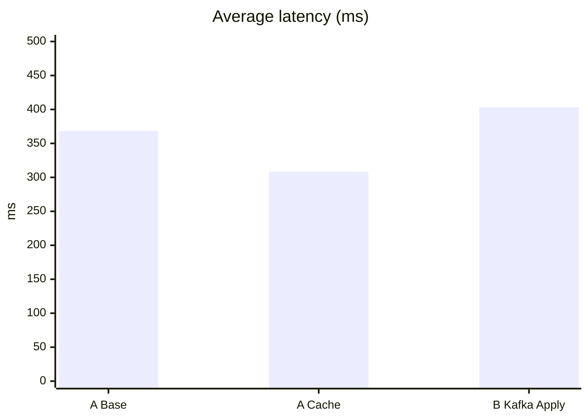
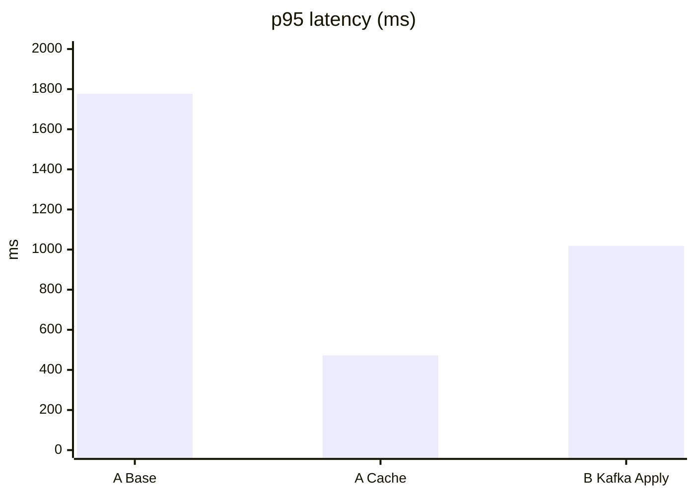
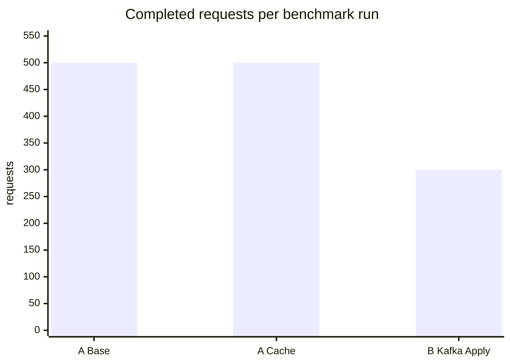

# Performance Charts

Source: `docs/perf-results.json`

## Average latency

## p95 latency

## Throughput proxy (requests completed in benchmark run)

## Interpretation

- `A Base` = job search + detail without warm-cache benefit
- `A Cache` = same scenario with Redis-backed warm-cache path
- `B Kafka Apply` = application submit including DB write + Kafka event publish

The strongest result is the large reduction in tail latency for Scenario A after caching is active.
